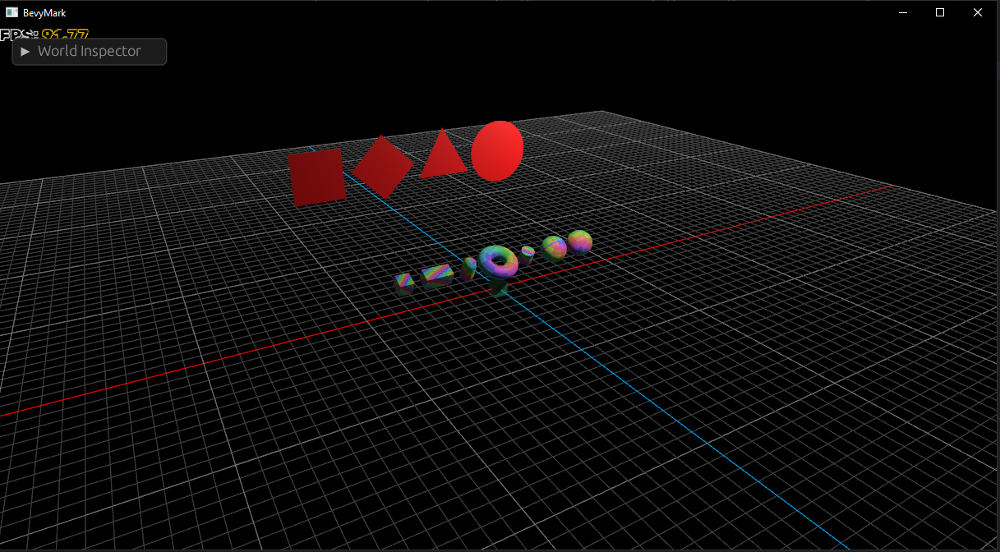

# Grid plane



Grid plane is a Rust plugin for the Bevy game engine that allows you to add a grid plane inside your scene. This plugin provides a simple way to create a grid on 3 axes: `xy`, `yz`, and `zx`.


## Features
- Add grid plane on the scene.


## Usage
To use the bevy_grid plugin, simply add it to your Bevy app's plugin list:

```rust
use bevy::prelude::*;
use grid_plane::GridPlanePlugin;

fn main() {
    App::new()
    .add_plugins(DefaultPlugins)
    .add_plugin(GridPlanePlugin::default())
    .run();
}
```


## Usage with custom options

```rust
use bevy::prelude::*;
use grid_plane::{GridPlanePlugin, GridAxis};

fn main() {
    App::new()
    .add_plugins(DefaultPlugins)
    .add_plugin(GridPlanePlugin { 
        grid_axis: GridAxis::Zx,
        size: 150,
        spacing: 1.0,
        color: Color::GRAY,
        color10: Color::CYAN,
        x_axis_color: Color::RED,
        y_axis_color: Color::GREEN,
        z_axis_color: Color::BLUE,
    })
    .run();
}
```


## Examples
The Grid Plugin comes with three example scenes to get you started:
- examples/grid_plane_default.rs
- examples/grid_plane_with_options.rs
- examples/grid_plane_with_some_options.rs

To run an example, simply navigate to the example directory and run cargo run:


## Compatible Bevy versions

| grid_plane | bevy |
| ---------- | ---- |
| 0.1.0      | 0.10 |


## License

Grid plane is licensed under MIT

